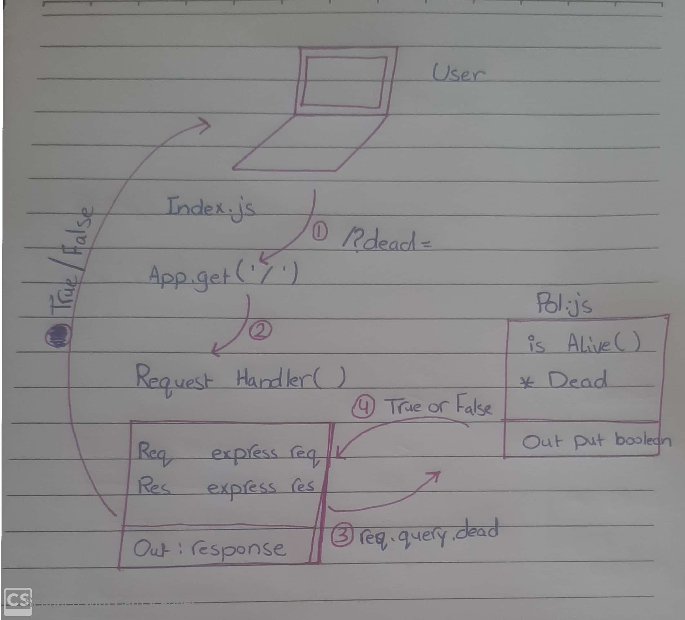

# LAB - 00

## Proof of life Server

### Author: Fatema Owedah

### Links and Resources

- [submission PR](https://github.com/401-advanced-javascript-fatemaOwedah/lab-00/pull/1)
- [Travis](https://travis-ci.com/github/401-advanced-javascript-fatemaOwedah/lab-00)
- [front-end application](https://fatemaowedah-lab-00.herokuapp.com/)

#### Documintation
- [jsdoc](https://fatemaowedah-lab-00.herokuapp.com/docs/)

### Modules
#### `pos.js`
##### Exported Values and Methods

###### `is Alive(dead) -> boolean`
Return true/false to indicate how the server works

### Setup

#### `.env` requirements 

- `PORT` - Port Number

#### How to initialize/run your application 

-  `npm start`
-  Endpoint: `/`
  -Returns a boolean
-  Endpoint: `/docs`
  -Returns a JSDoc Documintation Page

#### Tests

- Unit Tests: `npm test`
- Lint Tests: `npm run lint`

#### UML

